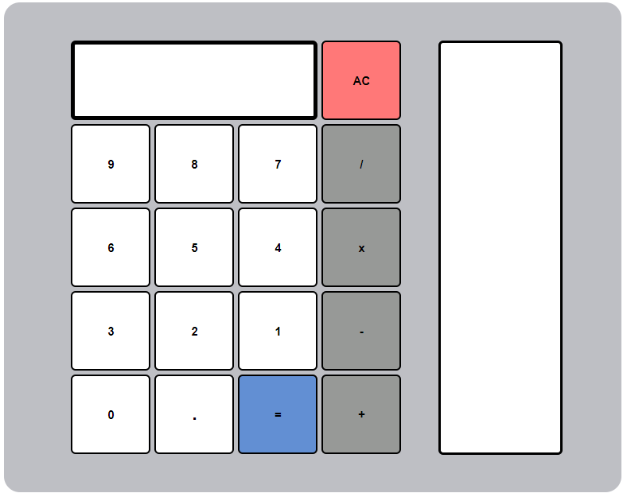

# Calculadora Interactiva

Este proyecto es una calculadora interactiva desarrollada durante el primer año del curso de **Desarrollo de Aplicaciones Web (DAW)**. La aplicación permite realizar operaciones básicas y mantiene un historial de las operaciones realizadas.

  

## Funcionalidades
- **Operaciones básicas:** Suma, resta, multiplicación y división.
- **Historial:** Visualiza las operaciones realizadas en una barra lateral.
- **Interfaz amigable:** Uso de botones interactivos con efectos visuales al pasar el ratón.
- **Reinicio de calculadora:** Borra los datos actuales y restablece la interfaz.
- **Gestión de errores:** Maneja divisiones entre cero mostrando un mensaje de error.

## Tecnologías Utilizadas
- **HTML5:** Para la estructura del proyecto.
- **CSS3:** Para los estilos visuales.
- **JavaScript:** Para la lógica y las interacciones dinámicas.

## Cómo Usar
1. Ingresa los números presionando los botones.
2. Selecciona una operación (+, -, x, /).
3. Presiona el botón `=` para ver el resultado.
4. Utiliza el botón `AC` para reiniciar la calculadora.
5. Observa el historial de operaciones en la barra lateral derecha.

## Estructura del Proyecto
- `Calculador.html`: Estructura principal de la calculadora.
- `Calculador.css`: Estilos para el diseño visual del proyecto.
- `Calculador.js`: Lógica del funcionamiento de la calculadora y gestión del historial.

## Notas
- **Propósito educativo:** Este proyecto fue desarrollado como práctica en el curso de DAW.
- **Gestión de errores:** El proyecto incluye manejo básico de errores como evitar divisiones entre cero.

## Créditos
Calculadora desarrollada por **Samuel Moniz** durante el **primer año de DAW**.
